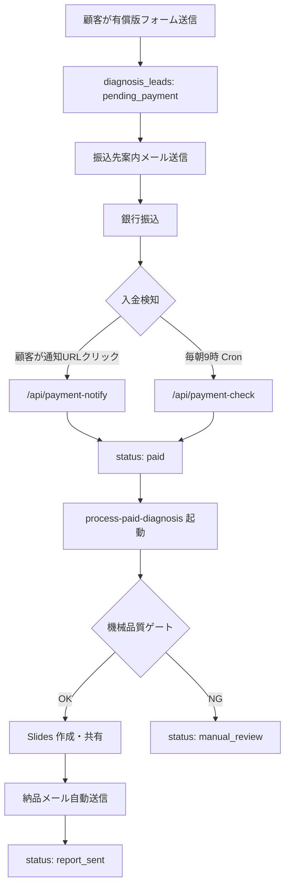

# 有償版 AI活用診断 完全自動運用手順 v1.0

## 1. 結論

有償版は「人間のチェックなしで顧客へ納品する」前提で設計する。ただし、無条件にAI出力を送るのではなく、機械チェックを通過した場合だけ自動送付する。

公開・納品文面では「AIによる下書き生成と人による確認で作成」と書かない。正しい表現は「フォーム入力をもとにAIが自動生成し、品質ゲート通過後に自動送付しています」。

現時点の基本方針:
- 顧客申込後、振込先案内メールを自動送信する
- 入金確認は freee API の自動照合、または顧客クリック起点の即時照合で行う
- 入金確認後、`process-paid-diagnosis` が詳細レポートを生成し、Google Slides を自動共有し、顧客へ送付する
- 生成失敗、禁止語、未置換プレースホルダー、構造不足があれば送付せず `manual_review` に落とす
- `manual_review` は管理画面から再実行できる

本番公開は、Vercel 本番環境変数と Supabase Secrets の設定完了後に行う。未設定のまま paid 申込ガードを外さない。

## 2. 完全自動フロー

## 3. 品質ゲート

自動送付前に最低限止める条件:
- JSON 構造が壊れている
- 7件の施策が揃っていない
- ロードマップ、補助金候補、リスク欄が不足している
- `{{paid_*}}` の未置換プレースホルダーが残っている
- 宇宙、医療機関、防災拠点、家庭用ガーデニング、産直EC、ビニールハウス、SaaS外部販売などの禁止テーマが含まれる
- 施策ごとの領域、詳細、アーキテクチャ、削減時間、月額価値、算定根拠が欠けている

品質ゲートを通らない場合は顧客へ送信しない。`manual_review` に落とし、管理画面から再実行または返金対応を行う。

## 4. 返金・キャンセル方針

忖度なしの判断として、¥5,500の有償診断は初期フェーズでは「広めに返金する」方が合理的。ただし「何か言われたら返金」とだけ内部運用にすると、対応が属人化し、顧客にも表示できない。

推奨する明文化:
- 入金後、レポート納品前のキャンセルは全額返金
- レポート納品後も、内容に重大な不備がある場合、または顧客が満足しない場合は、納品日から7日以内の申し出に限り原則全額返金
- 返金額は受領済みの ¥5,500。顧客側の振込手数料は原則対象外。ただし Optiens 側の明確な不備がある場合は個別判断
- 導入支援契約に進んだ場合、有償診断費用は初期費用に全額充当する
- 返金時は freee 側で売上取消または返金取引を記録し、既発行の領収情報と対応関係を残す

理由:
- 完全自動納品は品質のばらつきがゼロではない
- 低単価サービスで返金交渉に時間を使う方が損失が大きい
- 返金ポリシーを明確にすると、特定商取引法上の「申込みの撤回・解除」に関する表示にも使いやすい

## 5. 請求書・領収書・インボイス対応

### 5-1. 基本運用

有償版 ¥5,500 は、メール内で電子請求書と電子領収書の情報を明示する。顧客が正式PDFを希望した場合は freee でPDFを発行する。

メールに含める項目:
- 請求番号: `INV-{application_id}`
- 領収書番号: `R-{application_id}`
- 宛先: 申込企業名
- 取引日/発行日/領収日
- 取引内容: 【詳細版】AI活用診断（詳細レポート）
- 税抜金額: ¥5,000
- 消費税額（10%）: ¥500
- 合計（税込）: ¥5,500
- 発行者: 合同会社Optiens
- 適格請求書発行事業者登録番号: `T9090003003025`

### 5-2. freee 記帳

入金確認後:
1. freee の銀行明細に ¥5,500 の入金が入る
2. `diagnosis_leads.freee_txn_id` に wallet transaction ID を保存する
3. freee 側では売上として登録し、税区分は標準税率10%
4. 顧客からPDF請求書・領収書の依頼があれば、freee で `INV-{application_id}` / `R-{application_id}` を備考に入れて発行する

返金時:
1. 管理画面で対象リードを `cancelled` に変更し、`admin_notes` に返金理由と返金日を記録
2. freee で返金取引を登録する
3. 顧客へ返金完了メールを送る
4. 既発行メール・PDF・freee 返金取引の対応関係を残す

## 6. 環境変数チェックリスト

### Vercel Production

必須:
- `SUPABASE_URL`
- `SUPABASE_SERVICE_ROLE_KEY`
- `RESEND_API_KEY`
- `CONTACT_FROM`
- `CONTACT_TO`
- `CRON_SECRET`
- `PAYMENT_NOTIFY_SECRET`
- `FREEE_CLIENT_ID`
- `FREEE_CLIENT_SECRET`
- `FREEE_REFRESH_TOKEN`
- `FREEE_COMPANY_ID=12562850`
- `SITE_URL=https://optiens.com`
- `ADMIN_PASSWORD`

推奨:
- `ADMIN_ALERT_EMAIL`

### Supabase Edge Function Secrets

必須:
- `SUPABASE_URL`
- `SUPABASE_SERVICE_ROLE_KEY`
- `RESEND_API_KEY`
- `OPENAI_API_KEY`
- `GOOGLE_SERVICE_ACCOUNT_EMAIL`
- `GOOGLE_SERVICE_ACCOUNT_PRIVATE_KEY`
- `GOOGLE_SLIDES_PAID_TEMPLATE_ID`
- `GOOGLE_SLIDES_OUTPUT_FOLDER_ID`
- `CONTACT_FROM`
- `CONTACT_TO`
- `SITE_URL`

推奨:
- `PAID_DIAGNOSIS_MODEL`

## 7. 公開前テスト

1. Vercel Production の環境変数を確認する
2. Supabase Secrets を確認する
3. `npm run build` を Node 20 で実行する
4. `/api/payment-check` を `Authorization: Bearer {CRON_SECRET}` 付きで実行し、認証と freee 接続を確認する
5. テスト用 paid リードを作成する
6. 管理画面で `mark_paid` を実行し、入金確認メールと領収書情報が届くことを確認する
7. `process-paid-diagnosis` が Slides URL を生成し、顧客メールを送ることを確認する
8. `manual_review` を意図的に作り、管理画面から再実行できることを確認する
9. 顧客向けメール内の請求書・領収書情報を確認する
10. paid 申込ガードを外す

## 8. レポート生成失敗時の手動復旧

### 8-1. まず確認する場所

- 管理画面: `/admin/leads`
- 対象ステータス: `manual_review`, `processing` のまま止まっているリード
- Supabase: `diagnosis_leads.last_error`, `slides_url`, `sent_at`, `report_sent_at`

### 8-2. 顧客へ送付済みか判定

- `slides_url` なし、`report_sent_at` なし: 顧客へは未送付。再実行または返金
- `slides_url` あり、`report_sent_at` なし: Slides 作成後、メール送信で失敗した可能性。URLを確認し、納品メールのみ再送
- `report_sent_at` あり: 顧客へ送付済み。重複送信に注意

### 8-3. 再実行手順

1. `/admin/leads/{id}` を開く
2. `last_error` と入力内容を確認する
3. 入力不足や明らかな誤字があればフォーム項目を修正する
4. 「有償レポート生成・送付」をクリックする
5. 成功したら `status=report_sent` と `slides_url` を確認する
6. 失敗が続く場合は、24時間以内に返金または個別対応に切り替える

### 8-4. 返金へ切り替える基準

- 同一リードで再実行2回失敗
- Google Slides API / Drive 権限エラーが継続
- OpenAI クォータまたはモデル障害で当日復旧が見込めない
- 顧客からキャンセル/返金希望が来た
- 自動生成結果が品質ゲートを通らない

返金判断時は、顧客へ「自動生成処理が正常に完了しなかったため返金する」と簡潔に伝える。言い訳を長く書かない。

## 9. 公的根拠メモ

- 国税庁「適格請求書等保存方式」: 適格請求書は、一定事項を記載した請求書・納品書・その他類するもの。登録事業者は求めに応じて交付義務と写し保存義務がある。
  - https://www.nta.go.jp/taxes/shiraberu/taxanswer/shohi/6498.htm
- 国税庁「請求書等の記載事項」: 登録番号、取引年月日、取引内容、税率別金額、消費税額等、交付先名称が必要。
  - https://www.nta.go.jp/taxes/shiraberu/taxanswer/shohi/6497.htm
- 特定商取引法ガイド「通信販売」: 有償の役務提供も対象。価格、支払時期・方法、提供時期、申込み撤回・解除条件等の表示が必要。
  - https://www.no-trouble.caa.go.jp/what/mailorder/
- 特定商取引法ガイド「通信販売広告」: キャンセル料など顧客に不利益がある条件は明確表示が必要。
  - https://www.no-trouble.caa.go.jp/what/mailorder/advertising.html
- 国税庁「電磁的記録に関する印紙税」: 印紙税の対象は文書であり、電磁的記録は文書に含まれないという整理が示されている。
  - https://www.nta.go.jp/law/shitsugi/inshi/02/10.htm

## 10. 改訂履歴

| 日付 | バージョン | 変更内容 |
|---|---|---|
| 2026-05-14 | v1.0 | 完全自動化方針、返金方針、請求書・領収書・インボイス運用、復旧手順を定義 |
