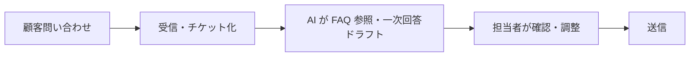
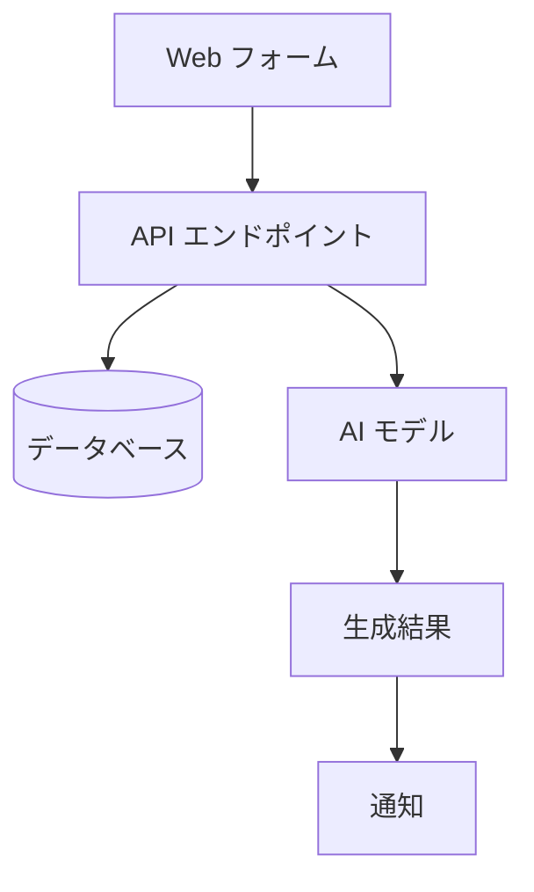

# 有償版 詳細レポート設計書 v1.0

## 1. 設計思想

### 価格戦略
- **¥5,500税込**: 中小企業の意思決定者が「自分の判断で即決」できる金額帯
- **導入支援契約に進んだ場合は初期費用に全額充当**: ロックイン回避・信頼醸成

### 無料版との明確な差別化
- 無料版: **方向性レポート**（業種×規模の汎用パターン・8スライド）
- 有償版: **個別具体提案**（業務特性に踏み込んだ提案・10〜15ページ）+ **60分MTG**

### CEO手動工数の最小化
- ✓ Web Search 込みで補助金・先行事例も自動調査
- ✓ 図解（フロー図・アーキテクチャ図）も SVG/Mermaid で自動生成
- ✓ **手動作業ゼロ**を前提にする（受注 → 自動生成 → 機械品質ゲート → 顧客へ自動送付）
- 例外: 60分 MTG（不可避な人間時間）

---

## 2. 全体構成（10〜15ページ）

| Page | タイトル | 主要内容 | 推定文字量 |
|---|---|---|---|
| 1 | 表紙 | 顧客名・診断日・Optiensロゴ | - |
| 2 | エグゼクティブサマリー | 提案の要旨・期待効果・コスト・期間 | 300字 |
| 3 | 御社の現状分析 | フォーム+追加情報の精査・業務特性 | 500字 |
| 4-5 | AI活用提案 5〜7件（詳細版） | 業務名・期待効果・優先度・前提条件 | 各業務300字×7 |
| 6 | フロー図（業務手順） | Mermaid生成・経営者向け理解しやすさ重視 | 図 |
| 7 | アーキテクチャ図（システム構成） | Mermaid生成・開発担当向け技術提示 | 図 |
| 8 | 段階的導入ロードマップ | 3ヶ月 / 6ヶ月 / 12ヶ月の段階計画 | 400字 + テーブル |
| 9 | ROI 詳細試算 | 業務別時間削減・コスト削減・累計効果 | 数表 + 200字 |
| 10 | コスト試算（フェーズ別） | 初期費・ランニング・スケール時 | 数表 + 200字 |
| 11 | ベンダー/サービスカテゴリ比較 | 一般名でカテゴリ比較・コスト感 | 比較表 |
| 12 | PoC 計画案 | 仮説検証ステップ・成功基準・期間 | 400字 + ステップ図 |
| 13 | 業種別補助金の該当性チェック | Web Search で取得・要件マッチング | 数表 |
| 14 | リスクアセスメント | 情報漏洩・依存・人材・対策 | 300字 + 対策表 |
| 15 | AI事業者ガイドライン整合性 | 経産省・総務省ガイドラインのチェック | チェックリスト |
| 16 | 次のステップ | 導入支援の流れ・60分MTG案内 | - |
| 17 | 裏表紙 | 連絡先・AI生成注記・ブランドコピー | - |

合計 **17スライド**（無料版 8スライドの約2倍）

---

## 3. 各セクションの詳細仕様

### Slide 2: エグゼクティブサマリー
- 「3行で分かる本提案」スタイル
- 月間効果額（合計）・初期費用・運用コスト・実装期間を1スライドで一覧
- 「忙しい経営者が最初の30秒で決める」ための要約
- 概算導入費は安売りしない。1業務MVPは **¥270,000〜360,000**、2業務実装は **¥420,000〜560,000**、3業務以上または外部連携多めは **¥600,000〜800,000+** を標準目安にする
- 実装期間は1業務なら3〜4週間、1〜2業務なら4〜6週間

### Slide 4-5: AI活用提案 5〜7件（詳細版）
無料版TOP3よりさらに踏み込む:
- **業務名**: 具体的な業務プロセス名
- **期待効果**: 月間時間削減 + 月間効果額（個別算出）
- **優先度**: A/B/C（実装容易度 × インパクト）
- **前提条件**: データ整備・社内合意・体制
- **想定リスク**: 個別の落とし穴
- **関連デモ**: 公開デモがある施策はURLを明記する（問い合わせ一次回答、見積書、社内検索、承認、管理画面、口コミ、文書レビュー等）

### Slide 6: フロー図（業務手順）
**Mermaid 自動生成**:

- 経営者にも理解できる粒度
- 業務単位で 1〜3 個のフロー図

### Slide 7: アーキテクチャ図（システム構成）
**Mermaid 自動生成**:

- 開発担当向け
- データの流れと責任分担を明示

### Slide 8: 段階的導入ロードマップ
| 期間 | フェーズ | 主要施策 | KPI |
|---|---|---|---|
| 1〜3ヶ月 | PoC・最小実装 | 1〜2業務に絞り効果検証 | 削減時間 X時間/月 |
| 3〜6ヶ月 | 本番展開 | 主要業務へ展開 | 利用率 X% |
| 6〜12ヶ月 | 拡張・最適化 | 周辺業務・データ整備 | ROI 累計 |

### Slide 9: ROI 詳細試算
無料版より踏み込む:
- 業務別に時間削減を分解
- 累計効果（12ヶ月・24ヶ月）
- 感度分析（ベスト/ベース/ワースト）

### Slide 11: ベンダー/サービスカテゴリ比較
**読める範囲に絞った推奨構成と代替案にする**:
| カテゴリ | 選択肢A | 選択肢B | 選択肢C |
|---|---|---|---|
| DB/認証 | Supabase | NoSQL/軽量DB | 既存クラウドDB |
| 生成AI | 軽量LLM | 中堅LLM | 上位LLM |
| 文字起こし | Circleback等 | gpt-4o-transcribe | クラウド音声認識 |

議事録要約・アクション抽出では、第一候補を Circleback 等の高精度な会議文字起こし/議事録SaaSにする。文字起こし、話者分離、要約、アクション、Webhook連携まで含めて導入しやすいため。OpenAI の gpt-4o-transcribe / Whisper 系 API は、独自UIや自社録音データ処理を作る場合の選択肢として扱う。

### Slide 12: PoC 計画案
- **目的**: 何を検証するか（精度？工数削減？）
- **対象業務**: 1〜2業務に絞る
- **期間**: 通常 4〜8 週間
- **成功基準**: 数値化された達成条件
- **判断ポイント**: PoC終了時に Go/No-Go の判定基準

### Slide 13: 業種別補助金の該当性チェック
**OpenAI Web Search で自動取得**:
| 補助金名 | 公募期間 | 上限額 | 補助率 | 該当性 | 引用URL |
|---|---|---|---|---|---|
| 小規模事業者持続化補助金 | 2026/4/1〜2026/6/30 | 50万円 | 2/3 | 高 | jgrants-portal.go.jp/... |
| 事業再構築補助金 | 2026/Q3予定 | 1500万円 | 1/2 | 中 | meti.go.jp/... |

- IT導入補助金は除外（Optiens は IT導入支援事業者未登録）
- 該当性は AI判定（業種・規模・実施事業内容を照合）
- 申請支援は業務範囲外と明記

### Slide 14: リスクアセスメント
「発生可能性: 中」を並べると導入障害に見えやすいため、列名は **管理方針** とし、対策込みで表現する。

| リスク | 影響 | 管理方針 | 対策 |
|---|---|---|---|
| 情報漏洩 | 高 | 重点管理 | 機密情報の学習除外・監査ログ |
| AI依存（人的スキル低下） | 中 | 運用で管理 | 承認点を重要業務に限定 |
| 出力品質のばらつき | 中 | 初期対策で低減 | 構造化出力検証・禁止表現チェック |
| 規制変更 | 低 | 月次確認 | 定期チェック体制 |

### Slide 15: AI事業者ガイドライン整合性
経産省・総務省「AI事業者ガイドライン」のチェックリスト:
- ✓ 透明性の確保
- ✓ 人間中心の判断
- ✓ プライバシー保護
- ✓ セキュリティ確保
- ✓ 公平性
- ✓ アカウンタビリティ

各項目に「該当・対策案」を記載

---

## 4. 技術設計

### 4.1 トリガー
- フォーム送信時に `plan='paid'` で挿入
- 入金確認後 → status='paid' → Edge Function `process-diagnosis-paid` 起動
- （もしくは無料版と同じ Edge Function 内で plan 分岐）

### 4.2 OpenAI 呼び出し設計

**段階的に複数回呼び出し**（1回で17スライド分は厳しい）:

```typescript
// Phase 1: コア分析（gpt-5 + Web Search）
const phase1 = await openai.responses.create({
  model: 'gpt-5',
  input: [...],
  tools: [{ type: 'web_search_preview' }],
  // 出力: current_summary, top7_proposals, automation_direction
})

// Phase 2: ROI/コスト詳細（gpt-5・推論強め）
const phase2 = await openai.chat.completions.create({
  model: 'gpt-5',
  reasoning_effort: 'high',
  // 入力: phase1出力 + フォームデータ
  // 出力: roi_detailed, cost_phased, sensitivity
})

// Phase 3: 図解生成（Mermaid・gpt-5-mini）
const phase3 = await openai.chat.completions.create({
  model: 'gpt-5-mini',
  // 出力: flow_chart_mermaid, architecture_mermaid
})

// Phase 4: 補助金検索（gpt-5 + Web Search）
const phase4 = await openai.responses.create({
  model: 'gpt-5',
  tools: [{ type: 'web_search_preview' }],
  // 出力: subsidies[]
})

// Phase 5: ガイドライン整合性チェック（gpt-5）
const phase5 = await openai.chat.completions.create({
  model: 'gpt-5',
  // 出力: compliance_checklist
})
```

### 4.3 コスト見積（1件あたり）

| Phase | モデル | 入力tokens | 出力tokens | コスト |
|---|---|---|---|---|
| Phase 1 | gpt-5 + WebSearch | 2k | 4k | $0.30 |
| Phase 2 | gpt-5 (high) | 4k | 5k | $0.40 |
| Phase 3 | gpt-5-mini | 2k | 1.5k | $0.02 |
| Phase 4 | gpt-5 + WebSearch (3 queries) | 1k | 2k | $0.45 |
| Phase 5 | gpt-5 | 2k | 2k | $0.20 |
| **合計** | | | | **約 $1.40 / 1件** |

¥5,500（税込・¥5,000税抜）に対して **コスト比 4%**。十分な利益率。

### 4.4 Mermaid 図の Slides への埋込

**手法**: Mermaid 文字列 → SVG → PNG 化 → Slides 画像挿入

```typescript
// 1. Mermaid テキストを生成（OpenAI）
const mermaid = '...'

// 2. Mermaid CLI もしくは Web 変換 API で SVG 化
const svg = await mermaidToSvg(mermaid)

// 3. SVG を PNG にラスタ化（resvg 等）
const png = await svgToPng(svg)

// 4. Drive 経由で Slides に画像として挿入
await slidesAPI.batchUpdate({
  requests: [{
    createImage: {
      url: pngDataUrl,
      objectId: '...',
      // 配置情報
    }
  }]
})
```

代替案: Mermaid Live Editor 風 API or `mermaid-cli` の Deno 実装

### 4.5 PPTX/Slides テンプレ

**v2.0 (無料版8スライド) と別テンプレを作成**:
- ファイル名: `optiens-diagnosis-paid-template-v1.0.pptx`
- 17スライド構造
- プレースホルダー命名: `{{paid_xxx}}` プレフィックス（無料版と区別）

---

## 5. CEO 運用フロー

### 5.1 受注 → 完了の標準フロー

```
[受注（フォーム送信・¥5,500払込）]
   ↓
[入金確認（freee API 自動）]
   ↓
[Edge Function 起動 (5フェーズ・約3〜5分)]
   ↓
[Slides 自動生成・共有ドライブに保存]
   ↓
[CEO に Slack/メール通知（admin@optiens.com）]
   ↓
[CEO 最終チェック (5〜10分)]
   - 顧客名・業種関連事項に違和感なし？
   - 補助金の最新性・該当性に違和感なし？
   - 数値の整合性（ROI・コスト）
   - AI事業者ガイドラインの妥当性
   ↓
[OK → 顧客に Slides URL + MTG 日程調整リンクをメール送付]
   ↓
[60分 MTG 実施（1営業日以内に日程確定）]
   ↓
[フォローアップ（導入支援契約への打診）]
```

### 5.2 NG 時の対応

CEO チェックで NG の場合:
1. 該当箇所を Slides 上で直接編集
2. もしくは Edge Function を再実行（手動 trigger）
3. それでも NG の場合は手動で書き直し → 顧客に送付

### 5.3 KPI

- **受注 → 顧客送付** までの平均時間: **30分以内**（CEO最終チェック含む）
- **CEO 1件あたり工数**: **15分**（チェック5分 + メール送付10分）
- **MTG**: 60分（不可避）

合計 **75分/件 = ¥5,500/件 → ¥4,400/h 換算**

---

## 6. Phase 1 実装スコープ

### 6.1 必須実装（Phase 1）
- [x] 無料版 v14（v2.0 テンプレ・8スライド）
- [x] 有償版 PPTX テンプレ作成（19スライド）
- [ ] 有償版 Edge Function (`process-diagnosis-paid`)
- [ ] OpenAI Responses API + Web Search 統合
- [ ] Mermaid → PNG 変換パイプライン
- [ ] 入金確認 → Edge Function 起動の自動化（freee API 連携 OR 手動 trigger）

### 6.2 後回し（Phase 2）
- 補助金 DB 内製化（Phase 1 は Web Search で都度取得）
- 過去案件の参照（実績がない）
- 業種別 AI 提案テンプレ（Phase 1 は LLM の知識ベースで十分）

### 6.3 実装期間見積
- PPTX テンプレ作成: **1日**
- Edge Function 実装（5フェーズ）: **2〜3日**
- Mermaid 統合: **1日**
- テスト・デバッグ: **1〜2日**
- **合計: 1週間**

---

## 7. 開発スケジュール

| 週 | 作業 |
|---|---|
| Week 1 | 無料版 v2.0 完了確認・本番ローンチ |
| Week 2 | 有償版 PPTX テンプレ作成・Edge Function 設計 |
| Week 3 | Edge Function 実装（Phase 1〜3） |
| Week 4 | Mermaid 統合・Phase 4-5 実装・テスト |
| Week 5 | β顧客 1〜2社で本番テスト・フィードバック反映 |
| Week 6 | 一般公開 |

---

## 8. 改訂履歴

| 日付 | バージョン | 変更内容 |
|---|---|---|
| 2026-05-08 | v1.0 | 初版作成（無料版 v2.0 レビュー結果反映） |
| 2026-05-11 | v1.1 | 簡易版 v3 のフィードバック反映（means タグ・業種規模感・時給3,500・年間/3年累計） |
| 2026-05-13 | v1.2 | 業務階層別時給に変更（パート¥1,300・一般¥2,000・経営者¥4,000） staff_level タグを追加 |
| 2026-05-14 | v1.6 | Google Slides テンプレを現行ブランドカラーへ刷新。Q&A・ランニングコストの表示崩れ、旧ID参照、未置換テスト項目を修正 |
| 2026-05-14 | v1.7 | Webサイト実装に合わせてブランドカラーをディープラピス `#1F3A93` / 桜 `#E48A95` に再定義。有償レポートとしての評価基準を「意思決定材料」へ引き上げ |

---

## 9. v1.1 反映ルール（2026-05-11 簡易版フィードバックを反映）

### 9.1 提案手段の明示（means タグ）

詳細版でも、各提案には手段を明示すること。area の冒頭に角括弧でタグを付与する：

| タグ | 意味 | 該当例 |
|---|---|---|
| `[AIエージェント]` | LLM / OCR / RAG / AI による自然言語処理が中核 | 問い合わせ自動分類・カルテ要約・例外判断 |
| `[システム連携]` | 業務システム標準機能 / API / Webhook / Zapier 等（AI なし） | 予約システム標準のリマインダー・freee 自動仕訳 |
| `[運用整備]` | 定型テンプレ / チェックリスト / 運用ルール（AI なし） | 定型メールテンプレ・FAQ 整備・対応手順書 |

**運用ルール**:
- AI が不要な業務にまで AI を当てはめてはいけない
- 「定型文・テンプレで済むか？」→ Yes なら `[運用整備]`
- 「既存業務システムの標準機能・API 連携で済むか？」→ Yes なら `[システム連携]`
- 「分類・要約・自然言語理解・例外判断が必要か？」→ Yes なら `[AIエージェント]`
- 5〜7 件の提案のうち、AI:integration:simple の比率は **業種と課題によって柔軟**に
- 既に予約システムがあるキャンプ場では simple/integration 中心、AI は 1〜2 件でも構わない

### 9.2 業種別の現実的業務規模感

`paid_proposal_effect_basis_*`（削減根拠）を書くときは、業種ごとの現実的なボリュームに従う：

| 業種 | 月次目安 |
|---|---|
| 宿泊・キャンプ場 | 問い合わせ 20-60件 / 予約 20-80件（平日閑散・週末繁忙） |
| 飲食 | 予約 50-300件 / 問い合わせ 20-100件 |
| 工務店 | 見積依頼 5-30件 / 進行案件 同時 3-10件 |
| 醸造所 | 直販問い合わせ 10-50件 / 出荷 50-500件 |
| 観光ガイド | 体験予約 20-150件（季節差大） |
| パン屋・菓子 | 受注 30-200件 |
| 農業 | 季節依存（繁忙 vs 閑散で 10倍差） |
| サービス業 | 受注 10-100件 / 業務内容依存 |
| 製造業 | 受発注 10-200件 / 工程管理依存 |
| 自治体 | 問い合わせ 50-500件 |

「月150件」など根拠の薄い数値は使わない。従業員数 1〜5 人なら各業務量も小さい前提。
顧客が「割に合わない」と感じる過大提案より、現実的な提案の方が信頼を得られる。

### 9.3 ROI 計算ルール（v1.2・業務階層別時給）

各提案に `staff_level` タグ（'part' / 'staff' / 'owner'）を付与し、階層別の時給で算出する。

| staff_level | 時給 | 該当業務例 |
|---|---|---|
| `part` | ¥1,300/h | パート・補助業務（在庫チェック・清掃記録等） |
| `staff` | ¥2,000/h | 一般社員・スタッフ業務（メール対応・SNS投稿等） |
| `owner` | ¥4,000/h | 経営者・専門職業務（戦略判断・メニュー開発等） |

時給の根拠（2026 年公開統計）：
- パート：マイナビキャリアリサーチLab 全国平均 ¥1,310（2025年10月）
- 一般社員：厚労省「中企業の年収 ¥3,730,000 ÷ 1,920h ≒ ¥1,943/h」を ¥2,000 に丸め
- 経営者：企業実務サポートクラブ「20名以下社長月額中位 ¥700,000」÷ 1,920h ≒ ¥4,375 を ¥4,000 に丸め

計算式：
- `{{paid_roi_total_yen}}` = 各提案 [hours_per_month × staff_level 別時給] の合計
- `{{paid_roi_annual_yen}}` = `{{paid_roi_total_yen}}` × 12（自動計算）
- `{{paid_roi_three_year_yen}}` = `{{paid_roi_total_yen}}` × 36（自動計算）
- ROI スライドのフッターに「※ 業務階層別時給（パート¥1,300/h・一般¥2,000/h・経営者¥4,000/h）で算出。出典：厚労省・マイナビ・企業実務サポートクラブ」を明記
- 詳細表の各行に staff_level バッジ＋階層別時給を表示

### 9.4 「人間に残す」表現の禁止

業務仕分けや役割分担を記載する場合は、以下の言い換えを使うこと：

| 旧表現 | 新表現 |
|---|---|
| 人間に残すべき業務 | 人間が担当する業務 |
| なぜ人間に残すべきか | なぜ人間が担当するか |
| 自動化と人間残しの方向性 | AIと人間の役割分担 |
